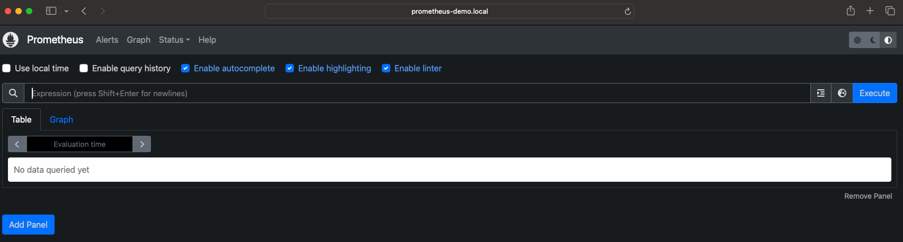

# Monitoring

This section of the demo is intended to be completed once the main demo has been stood up. If you have not done so yet, please review the main [README](../README.md).

## Table of Contents
- [Context](#context) 
- [Getting Started](#getting-started)
- [Getting Started](#getting-started) 

## Context

You have recently stood up your kubernetes cluster, deployed the "Hello, World!" web server, and are looking to configure monitoring and observability for this website. 

Using Prometheus and AlertManager we will collect metrics from our kubernetes cluster, and set up some sample alert so we know when our "Hello, World" application is healthy.

## Requirements

- Docker Desktop
- Kubectl
- Helm
- Editor of choice

## Getting Started

- Setup of the Kubernetes cluster via Docker Desktop & deployment of the "hello-world" demo.
    - If you have not completed that, please do so via the main [README](../README.md).

- Add the `prometheus-community` helm repo.

    ```bash
    helm repo add prometheus-community https://prometheus-community.github.io/helm-charts
    ```
    ```bash
    helm repo update
    ```

- Install the chart using the `values.yaml` in the prometheus directory.
    *Note:* The `prometheus` chart contains dependencies and I have enabled `alertmanager` and `kube-state-metrics` to stand up the necessary services for the following tasks.

    ```bash
    helm install prometheus-demo prometheus-community/prometheus --values monitoring/prometheus/values.yaml --create-namespace --namespace monitoring
    ```

- Update your `/etc/hosts` file to include the ingress that gets added when you installed the `prometheus` helm chart.
    
    ```bash
    ## DEMOS
    127.0.0.1	hello-world-demo.local
    127.0.0.1	prometheus-demo.local
    ```

- In your browser, visit `prometheus-demo.local` and you should see the default page similar to the below image.

    

- Navigating to the `Alert` page and you will see some active alerts. We enabled an HPA for some of the services deployed, but we did not install the `metrics-server` for the HPA to query. This was expected so we would have an alert ready as a sample here.

    

